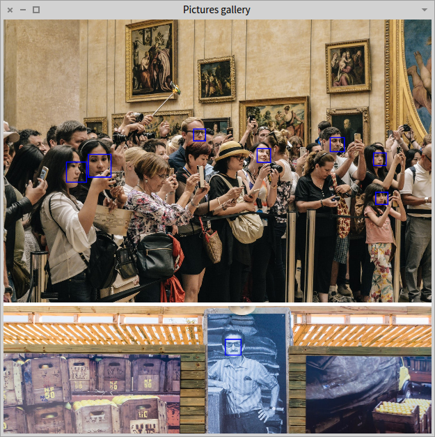
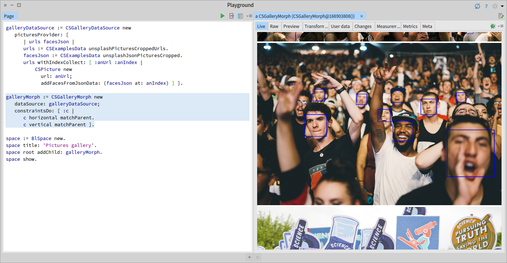
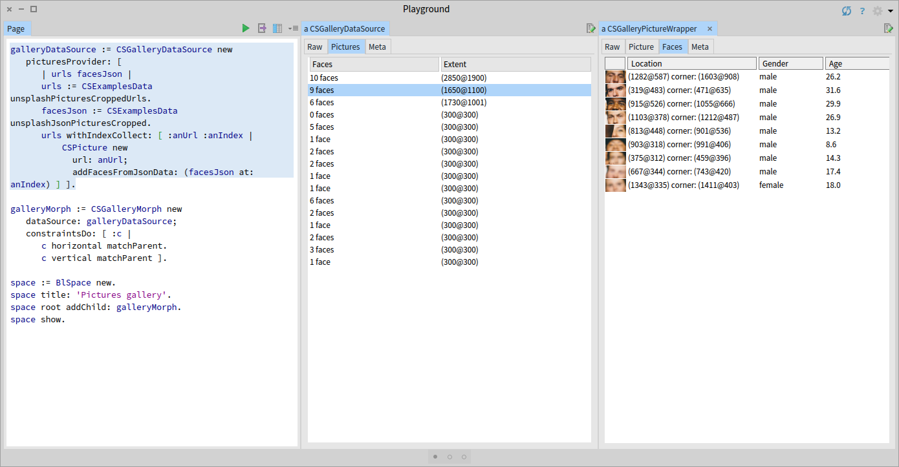

# Cognitive Service Demo: Gallery with face detection

This is an application that displays a galery of pictures and uses the Azures Face API to highlight faces within those pictures.



## Loading the code

Loading the complete application, including Bloc can be done with the following snippet:
```
Metacello new
   baseline: 'CognitiveServiceDemo';
   repository: 'github://chisandrei/cognitive-service-demo/src';
   load.
```

Loading just the model, without Bloc and the actual application can be done using the snipet below. You can use this if you just want to follow the tutorial without running the final application.
```
Metacello new
   baseline: 'CognitiveServiceDemo';
   repository: 'github://chisandrei/cognitive-service-demo/src';
   load: 'part1'.
```

## Starting the application

To start the application you need to configure a data source that will provide the user interface with a list of picture objects. 

We can configure the data source based on a list of URLs pointing to pictures. The class `CSExamplesData` provides an example of pictures from [unsplash.com](https://unsplash.com/). In case you have an API key for the Face API you can configure the data source just with the URL for the pictures. The Face API will then be used to locate faces within the given picture.

```
CSFaceApiClient defaultKey: Clipboard clipboardText asString.

galleryDataSource := CSGalleryDataSource new
	picturesProvider: [ 
		| urls |
		urls := CSExamplesData unsplashPicturesCroppedUrls.
		urls withIndexCollect: [ :anUrl :anIndex |
			 CSPicture new 
				 url: anUrl ] ].
		
CSGalleryMorph openInNewSpaceFor: galleryDataSource.
```

If you do not have an API key then the class `CSExamplesData` also provides the JSON data for identifing faces that would normally be returned by the Face API. You can configure the datasource to use this data.

```
galleryDataSource := CSGalleryDataSource new
	picturesProvider: [ 
		| urls facesJson |
		urls := CSExamplesData unsplashPicturesCroppedUrls.
		facesJson := CSExamplesData unsplashJsonPicturesCropped.
		urls withIndexCollect: [ :anUrl :anIndex |
			 CSPicture new 
				url: anUrl;
				addFacesFromJsonData: (facesJson at: anIndex) ] ].
        
CSGalleryMorph openInNewSpaceFor: galleryDataSource.
```

Instead of calling `openInNewSpaceFor:` to open the gallery you can also create a gallery object and open it in a new space manually:

```
galleryMorph := CSGalleryMorph new
	dataSource: galleryDataSource;
	constraintsDo: [ :c |
		c horizontal matchParent.
		c vertical matchParent ].

space := BlSpace new.
space root addChild: galleryMorph.
space show.
```

## Inspector extensions

To quickly esperiment with the gallery morph, instead of opening it in a new window, you can also inspect it. The inspector has a Live view that shows the gallery:



Inspecting the data source also show information about the pictures, like the number of faces from each picture:


